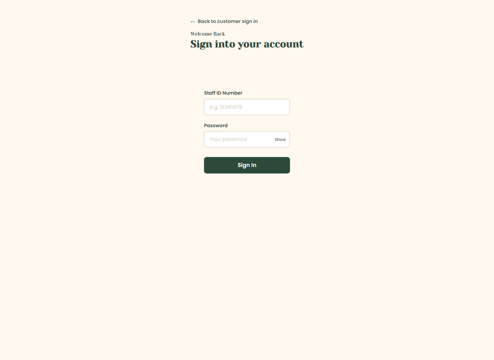
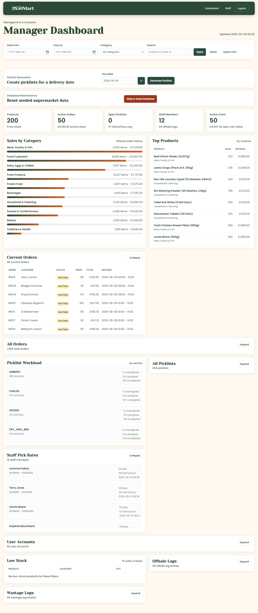
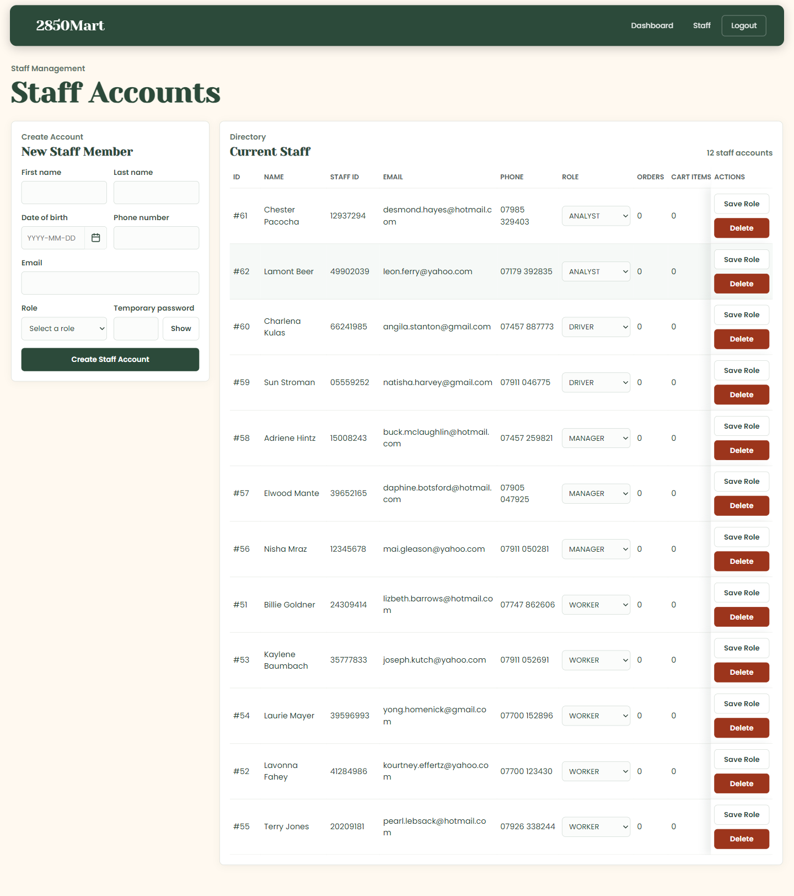
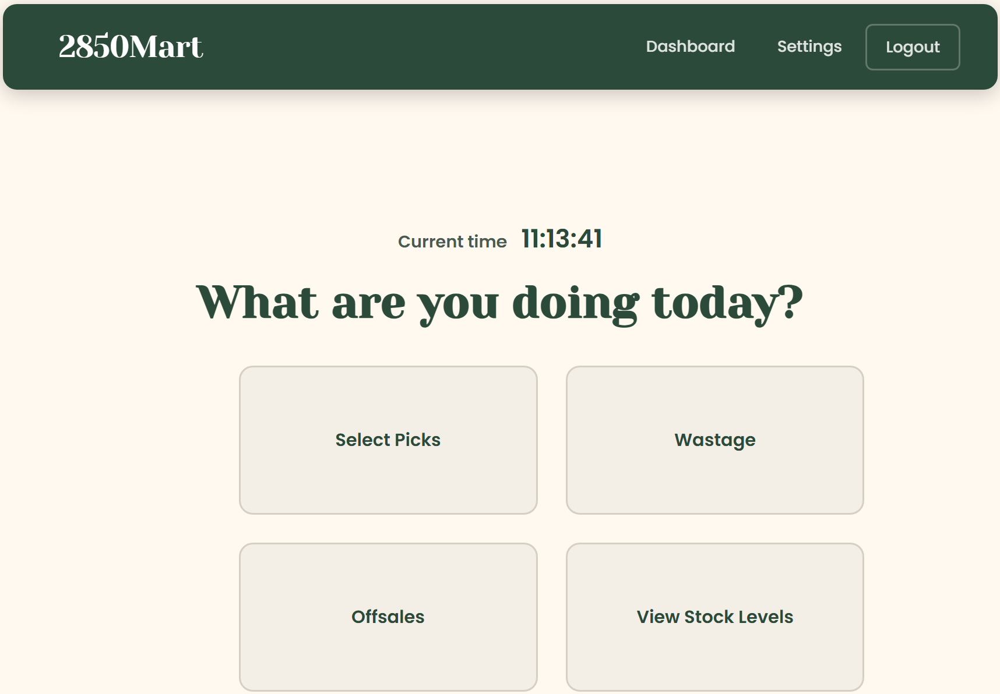
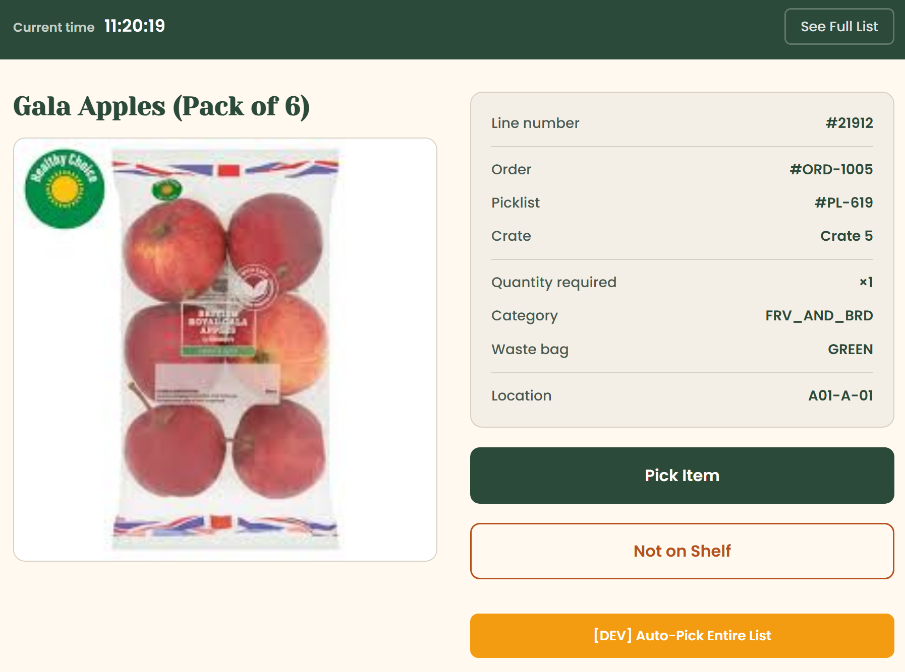
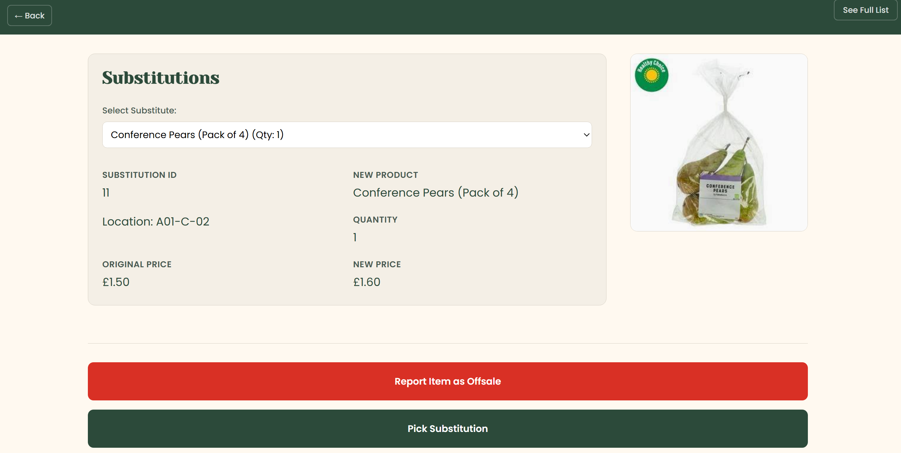

# SuperMarket Web Application (Group 25)
A comprehensive web application for supermarket shopping, stock management, warehouse operations, and business analytics.

## Overview
This platform is designed to support the entire lifecycle of a modern online supermarket. It integrates customer-facing shopping, warehouse logistics, and management analytics into a single cohesive system, allowing for efficient inventory management and order fulfillment.

## Core Features
- **Customers**: Browse products, manage baskets, place orders, and handle substitutions for out-of-stock items.
- **Warehouse Staff**: Receive deliveries, update stock, pick orders into physical crates, and record wastage/offsales.
- **Managers**: View real-time sales dashboards, generate reports, manage staff accounts, and access system audit logs.

## Tech Stack

| Layer          | Technology                                   |
|----------------|----------------------------------------------|
| **Server**     | Kotlin 2.3 · Ktor 3.4 · JDK 21               |
| **Database**   | SQLite · Exposed ORM                         |
| **Frontend**   | HTML / Vanilla CSS / JS (Served via Ktor)    |
| **CI/CD**      | GitHub Actions · Gradle 9.3                  |
| **Utilities**  | BCrypt (Security) · DataFaker (Seeding)      |

---

## Getting Started (Full Setup Guide)

You can run this project locally using **Visual Studio Code (VSCode)** or entirely in your browser using **GitHub Codespaces**. Follow the instructions below for your preferred environment.

### Option 1: Running via GitHub Codespaces (Recommended)

If you don't want to install anything locally, you can run the application entirely in the cloud.

#### 1. Launch the Codespace
1. Navigate to the repository page on GitHub.
2. Click the green **`<> Code`** button.
3. Switch to the **Codespaces** tab.
4. Click **Create codespace on main** (or click the `+` icon).
5. Wait a minute or two for the cloud environment to build and load in your browser.

#### 2. Running the Application
Once the VSCode interface loads in your browser, open a terminal (`Terminal > New Terminal`) and follow these steps:

1. **Grant execution permissions to Gradle.** *This step is critical in Codespaces before you can run the app:*
   ```sh
   chmod +x gradlew
   ```
2. Start the server:
   ```sh
   ./gradlew run

3. Once the server starts, VSCode will prompt you that an application is running on port `8080`. Click **Open in Browser** on the pop-up notification, or go to the "Ports" tab next to the terminal and click the globe icon next to port 8080.

### Option 2: Running Locally on VSCode

#### 1. Prerequisites
Before you begin, ensure you have the following installed on your machine:
*   **Git**: [Download Git](https://git-scm.com/downloads)
*   **Visual Studio Code**: [Download VSCode](https://code.visualstudio.com/download)
*   **JDK 21**: [Download Esclipse Temurin JDK 21](https://adoptium.net/temurin/releases/?version=21) (Ensure you set your `JAVA_HOME` environment variable during installation).
*   **VSCode Extensions**: For the best experience, search for and install the **Extension Pack for Java** and the **Kotlin** extension inside VSCode.

#### 2. Clone the Repository
Open your terminal (or Git Bash) and run:
```sh
git clone [https://github.com/stockyy/Supermarket-App-Group25](https://github.com/stockyy/Supermarket-App-Group25)
cd Supermarket-App-Group25
```

#### 3. Running the Application
1. Open the cloned folder in VSCode (`File > Open Folder...`).
2. Open a new terminal within VSCode (`Terminal > New Terminal`).
3. If you are on Mac/Linux, ensure the Gradle wrapper has execution permissions:
   ```sh
   chmod +x gradlew


4. Start the server by running:
   ```sh
   ./gradlew run

*(Note: If the progress bar seems to hang at 83% or "Execution 83%", the server is actually running!)*

Once started, visit: **[http://localhost:8080/](http://localhost:8080/)**

---

## How to Use the System

> **Note:** The `identifier.sqlite` database is automatically refreshed and re-seeded with sample data each time the application is started. This ensures a clean environment for every session.

Upon launching the application, users can interact with the system in one of two primary roles: as a customer or as an employee.

### Customer Workflow
- **Browsing and Shopping**: Users can browse the product catalog, add items to their shopping cart, and proceed to checkout.
- **Account Creation**: To complete an order, customers are required to create an account.

### Employee Workflow
To access employee functions, navigate to the employee login portal.

#### Manager Access
- **Login Portal**: `/management/login`
- **Default Manager Credentials**:
    - **Staff ID**: `12345678`
    - **Password**: `Testing123!` (This is the default password for all pre-seeded accounts).

As a manager, you can explore the analytics dashboard or manage staff accounts. To test the warehouse picker workflow, you can obtain a worker's `staffId` by navigating to the "Staff" page from the manager's dashboard. After logging out, you can re-login using the worker's credentials.

*Note: The Driver role was not fully implemented. Analyst accounts have permissions equivalent to Managers.*

### Warehouse Manager Explained

The warehouse manager tools are accessed through the management area after signing in with a Manager or Analyst account. These tools are mainly used to monitor live operations, generate picklists for warehouse workers, manage staff accounts, and reset seeded demonstration data when needed.



After a successful Manager login, the user is redirected to `/management/dashboard`.



The dashboard provides the following management functions:

- **Generate Picklists**: From the manager dashboard, you can generate picklists for all outstanding orders scheduled for delivery on a selected date. This action makes the lists available to warehouse pickers.
- **Filter Dashboard Data**: The Date from, Date to, Category, and Search controls filter the visible sales, order, picklist, stock, offsale, and wastage information. Dates must use the `YYYY-MM-DD` format.
- **Export Reports**: The **Export CSV** button downloads the currently loaded dashboard data as `manager-dashboard-report.csv`.
- **Review Operational KPIs**: The KPI tiles show product count, active orders, open picklists, staff count, active carts, and related values.
- **Review Orders and Picklists**: Managers can inspect current orders, all orders, picklist workload by warehouse section, all generated picklists, and staff pick rates. Some larger panels are collapsed by default and can be opened with **Expand**.
- **Monitor Stock and Logs**: The dashboard highlights low-stock products and provides expandable offsale and wastage logs.
- **Reset Seeded Data**: The **Wipe & Seed Database** button rebuilds the demonstration dataset after a confirmation prompt. This is useful before demos or tests, but it resets seeded products, users, orders, baskets, picklists, offsale logs, and wastage logs. After a successful reset, the manager dashboard refreshes automatically so all panels show the newly seeded data.

Managers can also use the Staff page at `/management/staff` to create and maintain staff accounts.



On this page, managers can:

- **Create Staff Accounts**: Fill in the staff member's name, date of birth, phone number, email, role, and temporary password. The password must include uppercase and lowercase letters, a number, and a special character.
- **Use Generated Staff IDs**: After creating an account, the page displays the new 8-digit Staff ID, which the staff member can use to sign in.
- **Update Staff Roles**: Select a new role in the staff directory and click **Save Role**.
- **Delete Staff Accounts**: Click **Delete** and confirm the browser prompt. The backend prevents deleting the currently logged-in Manager account or removing the final remaining Manager account.

### Warehouse Picker Workflow
The warehouse picking interface is designed to enforce a strict, error-resistant workflow that ensures cold-chain compliance and order accuracy.

- **Dashboard**: After logging in (via the same page as the manager), a warehouse worker is directed to a central dashboard. From here, they can initiate a new picking session, log an offsale item, report wastage, or perform a manual stock check.

- **Reporting Wastage**: From the dashboard, workers can report items that are unsellable due to damage, expiry, or other reasons. This process helps maintain accurate inventory records and tracks product loss.

- **Checking Stock Levels**: Workers can perform manual stock checks from the dashboard to verify the quantity and location of products. This ensures that physical stock matches system records and helps identify discrepancies.



- **Zone-Based Picking**: To begin picking, the worker must click "Select Picks" and choose a specific warehouse zone (e.g., Ambient, Chilled, Frozen). This groups items by temperature requirements, ensuring compliance.
    - *Prerequisite*: Picklists must first be generated by a manager before they can be claimed by a worker.

- **Crate Assignment**: Before a picking session starts, the system prompts the worker to enter the IDs for the crates on their trolley (formatted as `CRATE-XXX`, e.g., `CRATE-001`). This action binds specific customer orders to physical crates for the duration of the pick.
  - *Note on Scanning*: In a production environment, this step would be performed using a barcode scanner to eliminate manual entry. This feature is simulated due to the current desktop-based nature of the project.

- **Active Picking Process**:
    1. For each item, the worker clicks "Pick Item" (another step that would typically involve scanning).
    2. They must then confirm the exact quantity picked, ensuring accuracy.
    3. To prevent incorrect order fulfillment, the system explicitly directs the worker to place the item into a specific, pre-assigned crate. The worker confirms this by entering the crate ID (this would once again typically involve scanning).

- **Distraction-Free Interface**: To maximize worker efficiency, the active picking screen is designed with minimal distractions. UI elements like the main site header are removed, ensuring the worker can solely engage in the immediate picking task and nothing else.



- **Exception Handling**:
    - **Not on Shelf**: If an item cannot be found, the worker can select "Not on Shelf". The system will then query the database and suggest pre-approved substitutions if available.
    - **Offsale**: When logging a product as an "Offsale", the stock level for the selected product is set to zero (eliminating "Phantom Stock") in the database and allows the picker to proceed to the next item without interrupting the workflow.
      - *Note on Offsaling*: This can also be done from the main worker dashboard.
    - **Stock Discrepancies**: The system permits workers to pick items even if the database indicates zero stock. This design choice empowers workers to correct real-world stock discrepancies (e.g., "phantom stock") when they physically locate an item that the system reports as unavailable.



- **Automated Picking (Developer Feature)**: A button is included to automatically complete an entire picklist. This is a development tool intended for testing and demonstration purposes to bypass manual picking.

- **Putaway**: After all items on a picklist have been processed, the system generates a final "putaway" summary. This directs the worker to deliver the completed crates to their designated final locations, such as a freezer, chiller, or a general staging area.

- **Performance Tracking**: The "Settings" page provides workers with access to their performance metrics, including their live average pick rate (items per hour) and a record of total completed picklists.

## Repository Layout
The project follows a modular Kotlin/Ktor structure. Below is a map of the key directories:

```text
.
├── .github/workflows/      # CI/CD: Automated builds and ktlint checks
├── gradle/                 # Gradle Wrapper for consistent builds
├── src/main/kotlin/        # Backend Logic
│   ├── Application.kt      # Main entry point and Ktor module setup
│   ├── controllers/        # Business logic for auth and picking workflows
│   ├── database/           # Exposed ORM tables, Seeder, and Query functions
│   └── routes/             # Ktor route definitions (Customer, Warehouse, etc.)
├── src/main/resources/     # Static Assets & Configuration
│   ├── application.yaml    # Server settings (Port, Modules)
│   ├── productData.json    # Source data for database seeding
│   └── static/             # Frontend Assets
│       ├── js/             # Client-side logic (Basket management, Nav)
│       ├── stylesheets/    # Structured CSS (Tokens, Base, Component-specific)
│       └── views/          # HTML templates (Partials, Dashboard views)
├── src/test/kotlin/        # Unit and Integration test suite
├── build.gradle.kts        # Dependency management and build scripts
└── identifier.sqlite       # Local database (generated automatically)
```

---

## Development Strategy

To maintain code quality and system stability, we adhere to the following workflow:

### Branching & Merging
- **Feature Branches**: All work must be done in `feature/...` branches.
- **Integration**: Feature branches must first merge into the `implementation` branch via a Pull Request.
- **Production**: Only the `implementation` branch is permitted to merge into `main`. Direct commits to `main` are blocked.

### Automated Checks (CI/CD)
Before any Pull Request can be merged into `implementation` or `main`, it **must** pass our GitHub Actions pipeline:
1.  **Gradle Build**: Ensures the project compiles correctly and all tests pass.
2.  **ktlint Check**: Enforces our coding standards. If your code is not formatted correctly, the check will fail.

### Meetings & Documentation
- Regular team meetings and retrospectives are held to track progress against sprint goals.
- All meeting minutes and architectural decisions are documented on the project wiki.

---
